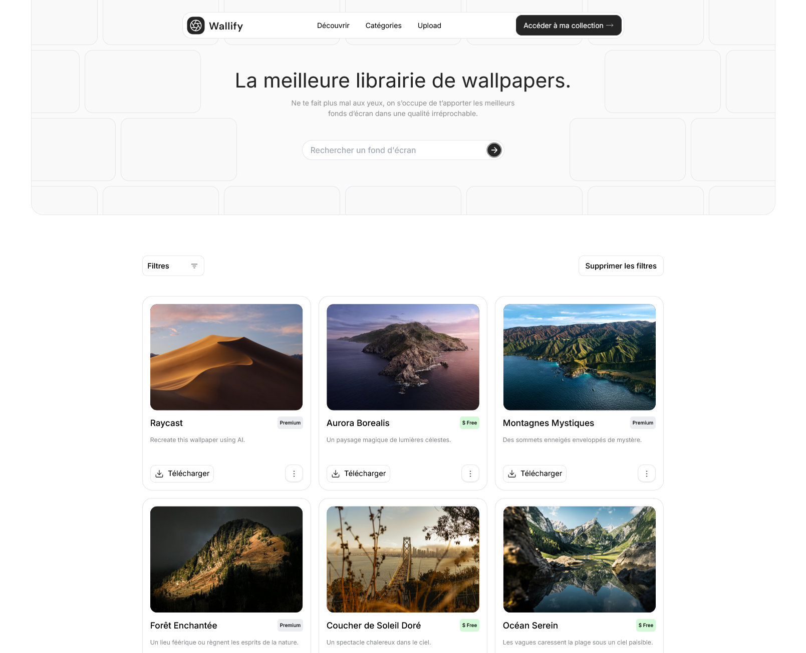

# (FR) Wallify - Landing Page Picture Cards 🚀

Bienvenue dans le **Walify - Landing Page Picture Cards** ! Réalisé dans le cadre de la communauté Spikes Challenge, ce projet a été l'occasion de me revoir toutes mes erreurs comises dans le challenge précédent des cards, tout en renforçant mes compétences pratiques en améliorant le projet avec une landing page totalement responsive.

---

## 🎯 **Objectifs**

- Pratiquer **React** pour la création de composants dynamiques
- Explorer les possibilités de **Tailwind** en matière de Responsive
- Implémenter des fonctionnalités interactives pour enrichir l'expérience utilisateur
- Améliorer les fonctionnalités précédentes (filtres, création des cards, animations...)

---

## ✨ **Fonctionnalités**

- **Filtrage des produits** : 
  - **Par nom** : Barre de recherche qui filtre les produits en dynamique sans rechargement de page
  - **Par type** : Filtre des produits en fonction de leur statut premium ou free
- **Animations** : Animations fluides pour l'apparition et la mise à jour des produits (plus d'apparitiobn en Math random)
- **Réinitialisation des filtres** :
  - Un bouton permet de **supprimer tous les filtres** appliqués pour afficher à nouveau la liste complète des produits

---

## ⚙️ **Technos Utilisées**

- **React.js** : La gestion de l'état et la création des composants
- **Tailwind** : Pour un stylisme rapide et responsive des cards
- **Vercel** : Déploiement sur l'écosystème gratuit

---
          
# (EN) Walify - Landing Page Picture Cards 🚀

Welcome to **Walify - Landing Page Picture Cards**!  
Created as part of the **Spikes Challenge** community, this project gave me the opportunity to revisit all the mistakes I made during the previous card challenge, while strengthening my practical skills by enhancing the project with a fully responsive landing page.

---

## 🎯 **Objectives**

- Practice **React** to create dynamic and reusable components.  
- Explore the possibilities of **Tailwind CSS** for responsive design.  
- Implement interactive features to enrich the user experience.  
- Improve previous functionalities (filters, card creation, animations, etc.).

---

## ✨ **Features**

- **Product Filtering**:  
  - **By Name**: A search bar that dynamically filters products without reloading the page.  
  - **By Type**: Filters products based on their status (premium or free).  

- **Smooth Animations**:  
  - Seamless animations for product appearance and updates, avoiding random effects.  

- **Filter Reset**:  
  - A convenient button to **clear all applied filters** and display the full product list again.  

---

## ⚙️ **Technologies Used**

- **React.js**: For state management and the creation of dynamic components.  
- **Tailwind CSS**: For rapid styling and responsive card design.  
- **Vercel**: For deployment on a free, fast, and modern hosting platform.  

---
